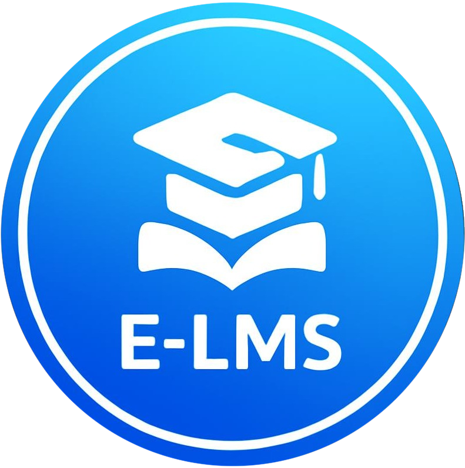

<div align="center">

  

  # 🎓 SPI AI-ELMS
  ### **AI-Powered E-Learning Platform for Saint Paul Institute**
  #### *ប្រព័ន្ធគ្រប់គ្រងការសិក្សាឆ្លាតវៃ នៃវិទ្យាស្ថានសន្តប៉ូល*

  <p align="center">
    <a href="https://spilms.tech"></a>
    <a href="https://laravel.com"></a>
    <a href="https://vuejs.org"></a>
    <a href="https://inertiajs.com"></a>
    <a href="https://tailwindcss.com"></a>
    <a href="https://typescriptlang.org"></a>
    <a href="https://threejs.org"></a>
  </p>

  <p align="center">
    <a href="#-overview">Overview</a> •
    <a href="#-key-features">Key Features</a> •
    <a href="#-tech-stack">Tech Stack</a> •
    <a href="#-system-architecture">Architecture</a> •
    <a href="#-portals--modules">Portals</a> •
    <a href="#-installation--setup">Getting Started</a> •
    <a href="https://spilms.tech/privacy">Privacy Policy</a> •
    <a href="https://spilms.tech/terms">Terms of Service</a> •
    <a href="#-license">License</a>
  </p>


  ---
</div>

## 🌟 Overview

**SPI AI-ELMS** is a state-of-the-art, enterprise-grade AI-powered E-Learning Management System designed specifically for **Saint Paul Institute (SPI)**. It streamlines modern higher-education workflows, interactive content delivery, assessment analytics, fee collections, real-time communications, and public certificate verifications.

Built with **Laravel 11**, **Inertia.js**, **Vue 3**, **Tailwind CSS v4**, and **PrimeVue**, the platform delivers a lightning-fast Single Page Application (SPA) experience with robust server-side security, offline PWA synchronization, and responsive Three.js 3D user interfaces.

---

## ✨ Key Features & Capabilities

```
┌─────────────────────────────────────────────────────────────────────────────┐
│                           SPI AI-ELMS ECOSYSTEM                             │
├───────────────────┬─────────────────────────┬───────────────────────────────┤
│  👨‍🎓 STUDENT PORTAL │  👨‍🏫 TEACHER PORTAL     │  🛡️ ADMIN & GOVERNANCE         │
├───────────────────┼─────────────────────────┼───────────────────────────────┤
│ • Interactive Video│ • Course Curriculum     │ • Real-time KPIs & Analytics  │
│ • Code Labs (C/Web)│ • Question Bank Manager │ • Financials & ABA PayWay Logs│
│ • PDF & Slide Hub │ • Live Class Scheduler  │ • Academic Structure (Fac/Dep)│
│ • Adaptive Quizzes │ • Assignment Grading    │ • AI Automations & Rules Engine│
│ • SWR Offline PWA │ • Teacher Payout Ledger │ • Audit Logs & Security Lock  │
│ • QR Certificates │ • AI Student Insights   │ • Telegram Broadcast Bot      │
└───────────────────┴─────────────────────────┴───────────────────────────────┘
```

### 🤖 1. AI-Driven Smart Learning
- **AI Content Generator:** Automatically generates chapter summaries, study flashcards, and practice quiz questions.
- **Adaptive Recommendations:** Identifies weak student topics and recommends targeted lessons and practice labs.
- **Automated Rules Engine:** Triggers personalized learning reminders, interventions, and certificates upon milestone completion.

### 🔐 2. Advanced Multi-Channel Authentication
- **Multi-Role Security:** Granular role-based access control for **Students**, **Teachers**, and **System Administrators**.
- **Telegram Bot Deep Linking:** Direct Telegram OAuth & 6-digit OTP delivery for instant account linking and password resets (`@spi_elms_auth_bot`).
- **Google Identity Services & Clerk OAuth:** Modern single sign-on (SSO) for students and educators.
- **Audit & Anti-Brute-Force:** Session tracking, login attempt monitoring, and automatic account freeze on anomaly detection.

### 💳 3. ABA PayWay & Automated Payment Module
- **Direct Banking Integration:** Seamless checkout with ABA PayWay QR and KHQR support.
- **Receipt Verification:** Automated transaction verification, invoice generator, revenue breakdown, and instructor revenue splits.

### 📜 4. Tamper-Proof Certificate Verification
- **Public Certificate Portal:** Instant verification of academic credentials via QR code and UUID lookup (`/verify-certificate/{uuid}`).
- **Template Builder:** Custom dynamic certificate layout designer for multiple majors and courses.

### ⚡ 5. High Performance & Offline PWA Sync
- **Stale-While-Revalidate (SWR):** IndexedDB local caching renders academic lists and student dashboards in milliseconds even with weak networks.
- **OPFS Video Downloader:** Offline video and document downloads for learning on the go.
- **Three.js 3D Backgrounds:** Serene 3D animated canvas with automatic CPU/GPU pausing on tab-switch and lightweight CSS fallback for mobile devices.

---

## 🏗️ System Architecture & Tech Stack

| Layer | Technologies |
| :--- | :--- |
| **Backend Framework** | [Laravel 11.x](https://laravel.com) (PHP 8.2+) |
| **Frontend Architecture** | [Vue.js 3.5](https://vuejs.org) + [Inertia.js v3](https://inertiajs.com) (TypeScript) |
| **Styling & Design System** | [Tailwind CSS v4](https://tailwindcss.com), [PrimeVue 4 (Aura Theme)](https://primevue.org), [Nuxt UI](https://ui.nuxt.com) |
| **Database & Cache** | [MySQL 8.0+](https://mysql.com) (52 Schema Tables with Performance Indexes) + [Redis](https://redis.io) |
| **3D & Visual Graphics** | [Three.js](https://threejs.org), [ApexCharts](https://apexcharts.com), [Lucide Icons](https://lucide.dev), [PrimeIcons](https://primevue.org/icons) |
| **PWA & Offline Storage** | [Vite PWA Plugin](https://vite-pwa-org.netlify.app), [IndexedDB (idb)](https://github.com/jakearchibald/idb), [OPFS](https://web.dev/origin-private-file-system) |
| **Build & Tooling** | [Vite 8.x](https://vitejs.dev), TypeScript, Workbox, PostCSS |

---

## 📱 Portals & Functional Modules

### 1. 🎓 Student Experience Portal
- **Dashboard:** Progress cards, weekly goals, enrolled courses, and upcoming assignment deadlines.
- **Rich Media Player:** Plyr.js & HLS.js streaming video player with speed control and VTT subtitle support.
- **Interactive Practice Labs:** Built-in CodeMirror IDE supporting web languages and C/C++ programming exercises.
- **Quiz System:** Timed assessments, multiple-choice questions, instant score feedback, and answer explanations.

### 2. 👨‍🏫 Teacher Course & Classroom Studio
- **Curriculum Builder:** Drag-and-drop course, module, chapter, and lesson creator.
- **Question Bank:** Central repository of categorized questions with difficulty levels and auto-scoring rules.
- **Student Analytics:** Granular visibility into individual lesson completion percentages, quiz scores, and drop-off rates.
- **Live Class Hub:** Schedule live lectures and link Google Meet/Zoom classrooms.

### 3. 🛡️ Administrator Command Center
- **Academic Hierarchy Management:** 
  - 🏛️ **Faculties:** Faculty of Information Technology, Tourism, Agriculture, etc.
  - 🏢 **Departments:** Computer Science, Software Engineering, Telecommunication.
  - 📚 **Majors:** Information Technology, Business Computing, Software Development.
  - 🗓️ **Academic Years & Semesters:** Dynamic academic calendar management.
- **Financial Analytics:** Total gross volume, teacher payouts, pending payment approvals, and CSV exports.
- **System Settings:** Multi-language manager (ភាសាខ្មែរ / English), SMTP configuration, Redis queues, and Cloudflare caching policies.

---

## 🚀 Installation & Setup

### Prerequisites
- **PHP** >= 8.2 (Extensions: `pdo_mysql`, `openssl`, `mbstring`, `tokenizer`, `xml`, `ctype`, `json`, `gd`, `fileinfo`)
- **Composer** >= 2.x
- **Node.js** >= 18.x & **npm** >= 9.x
- **MySQL** >= 8.0 or MariaDB >= 10.4

### 1. Clone Repository
```bash
git clone https://github.com/Kosalsensok/AI-Based-E-Learning-Platform-for-Saint-Paul-Institute-.git
cd AI-Based-E-Learning-Platform-for-Saint-Paul-Institute-
```

### 2. Configure Environment
```bash
cp .env.example .env
```
Update your database and service credentials in `.env`:
```env
APP_NAME="SPI AI-ELMS"
APP_URL=https://spilms.tech

DB_CONNECTION=mysql
DB_HOST=127.0.0.1
DB_PORT=3306
DB_DATABASE=elms-system
DB_USERNAME=root
DB_PASSWORD=

# Telegram Bot Authentication
TELEGRAM_BOT_TOKEN=your_telegram_bot_token
TELEGRAM_BOT_USERNAME=spi_elms_auth_bot

# Google OAuth / Clerk (Optional)
VITE_CLERK_PUBLISHABLE_KEY=your_clerk_key
```

### 3. Install Dependencies & Generate App Key
```bash
# Install PHP dependencies
composer install

# Install Frontend packages
npm install

# Generate application encryption key
php artisan key:generate
```

### 4. Run Migrations & Seed Database
```bash
php artisan migrate --seed
```

### 5. Start Development Server
```bash
# Run both Laravel backend & Vite frontend concurrently
npm run dev
# In another terminal:
php artisan serve
```
Open [http://localhost:8000](http://localhost:8000) in your browser.

---

## ⚡ Production Deployment & Optimization

When deploying to production, run the following optimization commands:

```bash
# 1. Compile and minify frontend assets
npm run build

# 2. Optimize PHP autoloader
composer install --optimize-autoloader --no-dev

# 3. Cache Laravel configurations, routes, and views
php artisan config:cache
php artisan route:cache
php artisan view:cache
php artisan event:cache

# 4. Run database migrations
php artisan migrate --force
```

---

## 🌐 SEO & Google Search Console Ready

- **Standardized Favicons:** Multi-resolution square icons (`48x48`, `96x96`, `192x192`, `512x512`) in compliance with Google Favicon guidelines.
- **Schema.org Structured Data:** Semantic JSON-LD markup declaring `EducationalOrganization` metadata.
- **Dynamic Sitemap & Robots.txt:** Located at `/sitemap.xml` and `/robots.txt` for automatic Googlebot indexing.

---

## 👥 Contributors & Acknowledgements

- **Institution:** [Saint Paul Institute (SPI)](https://spi.edu.kh) — Tram Kak District, Takeo Province, Cambodia.
- **Lead Developer:** [Kosal Sensok](https://github.com/Kosalsensok)
- **Special Thanks:** All educators, students, and open-source contributors who helped shape the platform.

---

## 📄 License

The SPI AI-ELMS platform is open-source software licensed under the **[MIT License](LICENSE)**.

<div align="center">
  <sub>Built with ❤️ for Saint Paul Institute. Empowering Cambodia's next generation of digital leaders.</sub>
</div>
